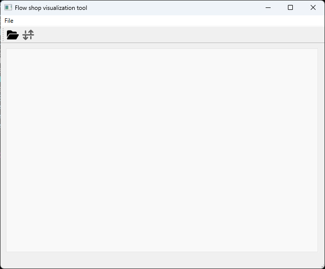
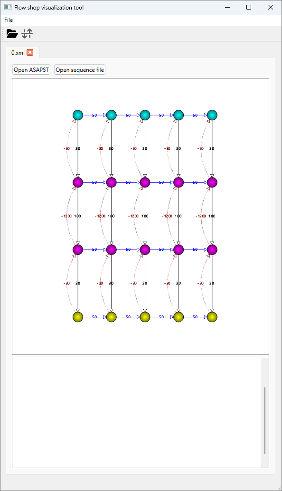
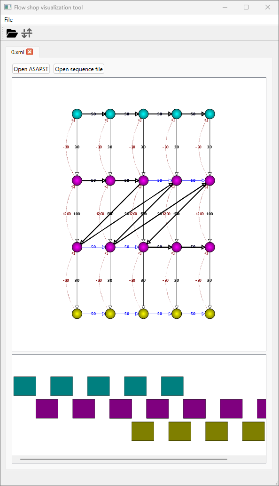

# Flexible Manufacturing System Scheduler

## Table of Contents
- [Flexible Manufacturing System Scheduler](#flexible-manufacturing-system-scheduler)
  - [Table of Contents](#table-of-contents)
  - [Relevant links:](#relevant-links)
  - [How to Install](#how-to-install)
  - [Building](#building)
    - [Requisites](#requisites)
    - [Building the scheduler](#building-the-scheduler)
    - [Building the visualization](#building-the-visualization)
    - [CMake Presets](#cmake-presets)
    - [VS Code - recommended](#vs-code---recommended)
      - [Configuring clangd for language completion](#configuring-clangd-for-language-completion)
  - [Running the scheduler](#running-the-scheduler)
    - [Flow-shop and job-shop problems](#flow-shop-and-job-shop-problems)
    - [Production line problems](#production-line-problems)
    - [Visualisation](#visualisation)
      - [Opening a problem](#opening-a-problem)
    - [Full help from the CLI:](#full-help-from-the-cli)
  - [Acknowledgements](#acknowledgements)
  - [Scripts - outdated since 2021](#scripts---outdated-since-2021)

## Relevant links:

- [Documentation](https://sam-fms.pages.tue.nl/fms-scheduler)
- [Coverage](coverage/index.html) (only works on CI pipelines)
- [Coverage main branch](https://sam-fms.pages.tue.nl/fms-scheduler/coverage/index.html)

## How to Install

Install Git, if you don't have it already

For the core scheduler code, you can use GCC (MingW), LLVM, MVSC etc. For the graph visualization, you will need Qt:
Download Qt from <https://www.qt.io/download-open-source>
Download Qt 6.5.3 (with MSVC if you are working on Windows)

Clone the project sources by executing the following from a command prompt which has git on the path:

```sh
git clone git@gitlab.tue.nl:sam-fms/fms-scheduler.git
cd fms-scheduler
```

## Building

### Requisites

- CMake 3.21 or higher
- Ninja (optional, but recommended, the guide assumes that you have it)
- C++20 compiler (GCC 13, Clang 17, MSVC 19.30 or higher)

### Building the scheduler

To build and run the scheduler, execute the following commands:

> **NOTE**: On Windows you should use a "Developer PowerShell for VS 2022"

```sh
cd scheduler
cmake -S . -B build
cmake --build build
```


### Building the visualization

To build and run the flow shop visualization, execute the following commands (on Windows use a Developer PowerShell for VS 2022):

> **NOTE**: On Windows you should use a "Developer PowerShell for VS 2022" and have the `CMAKE_PREFIX_PATH` environment variable set to the Qt 6.5.3 MSVC installation directory.

```sh
cd scheduler
cmake -S . -B build -DBUILD_TOOLS=ON
cmake --build build
```

### CMake Presets

Since CMake 3.19, CMake introduced presets. These set the flags for the configuration and build. We have the following configuration presets:

- `default`: Default configuration without tools, uses the default system compiler.
- `coverage`: Add coverage flags to the build. Only works on a unix environment with GCC and requires `gcovr` to be installed.
- `MSVC`: Use MSVC compiler. Only works on Windows.
- `clang`: Use Clang compiler. Works on any OS with clang installed.
- `GCC`: Use GCC compiler. Works on any OS with GCC installed (e.g., on Windows you can use MinGW).
- `tools`: Additionally build the GUI with the default compiler.
- `tools-MSVC`: Additionally build the GUI with MSVC.
- `tools-clang`: Additionally build the GUI with Clang.
- `tools-GCC`: Additionally build the GUI with GCC.

Then we also have the following build presets:

- `<configure_preset>-debug`: Build the project in debug mode.
- `<configure_preset>-release`: Build the project in release mode.
- `<configure_preset>-RelWithDebInfo`: Build the project in release mode with debug information.


### VS Code - recommended

Requisites:
- Visual Studio Code
- CMake Tools extension
- clangd extension

1. Open the project **root** folder in VS Code
2. Right after opening the CMake extension will ask you to select the `CMakeLists.txt` file, select the one in the `scheduler` folder.
3. The CMake tools extension should ask you for the configure preset. If it doesn't, you should reload VS Code (<kbd>Ctrl</kbd>+<kbd>Shift</kbd>+<kbd>P</kbd> ➜  Reload Window).
4. After selecting the configure preset, CMake will start configuring the project.
5. After configuring, you can build the project by pressing <kbd>Ctrl</kbd>+<kbd>Shift</kbd>+<kbd>P</kbd> ➜ `CMake: Build` or by pressing `F7`.
6. You'll find the scheduler executable (`app`) in the `<build_dir>/bin/<config>` folder. Where `<config>` can be `Debug`, `Release`, or `RelWithDebInfo`.

#### Configuring clangd for language completion

While the Microsoft C/C++ extension is the most popular extension for C++ development, it has some drawbacks. The clangd extension is a language server that provides better code completion and diagnostics. To configure clangd with the compile commands generated by CMake, follow these steps:

Requisites:
- clangd extension
- `jq` command line tool on your `PATH`

1. Configure the project with CMake as explained in the previous section.
2. Rename the `.vscode/tasks.default.json` to `.vscode/tasks.json`
3. Run the task `Compile commands (windows)` or `Compile commands (unix)` depending on your OS.
4. A `compile_commands.json` file will be generated in the project root directory.
5. Restart clangd language server by pressing <kbd>Ctrl</kbd>+<kbd>Shift</kbd>+<kbd>P</kbd> ➜ `Clangd: Restart language server`.

## Running the scheduler

The scheduler is a set of tools that can be used to solve different scheduling problems. All the tools can be run with the `app` executable.

### Flow-shop and job-shop problems

To run a scheduler for a flow-shop or job-shop problem or re-entrant flow-shop, you can do as follows:

```sh
cd <build_dir>/bin/<config>
./app --input <path_to_input_file> --output schedule --algorithm <algorithm> --time-limit 5000
```
Where <algorithm> can be one of the following:
- `bhcs`: Bounded Heuristic Constraint Solver
- `mdbhcs`: Multi-Dimensional Bounded Heuristic Constraint Solver
- `asap`: BHCS that ranks the solutions based on the ASAP heuristic
- `neh`: MNEH scheduling heuristic
- `branch-bound`: Branch and Bound algorithm
- `sequence`: Use a custom sequence. Pass it with the `--sequence` flag. Used for testing purposes.
- `iterated-greedy`: Iterated Greedy algorithm. Used for simple job shops.
- `dd`: Decision Diagram algorithm.
- `ddseed`: Decision Diagram algorithm with provided seed. It will try other combinations that improve the seed.

For maintenance-aware scheduling there are the following algorithms, they require maintenance files:
- `mibhcs`: Maintenance-aware BHCS
- `misim`: Maintenance-simulation BHCS
- `asap`: ASAP BHCS
- `mineh`: Maintenance-aware NEH
- `minehsim`: Maintenance-simulation NEH

You can use the flag `--list-algorithms` to list all available algorithms.

### Production line problems

To run a scheduler for a production line problem, you can do as follows:

```sh
cd <build_dir>/bin/<config>
./app --input <path_to_input_file> --output schedule --algorithm <algorithm> --modular-algorithm <modular_algorithm> --time-limit 5000
```
Where <algorithm> is one of the algorithms mentioned above and <modular_algorithm> can be one of the following:
- `broadcast`: Broadcast propagation strategy where all modules propagate their constraints to all other modules.
- `cocktail`: Cocktail party propagation strategy where each module propagates its constraints to the next module until reaching the end and then back to the first module. Usually performs better than broadcast.

### Visualisation

There is a visualisation tool that can be used to visualise the schedule. It can be run as follows:

```sh
cd <build_dir>/bin/<config>
./flowshopvis
```

It should show the following window:



#### Opening a problem

You can use the folder icon or press <kbd>Ctrl</kbd> + <kbd>o</kbd> to open a problem. The problem should be in the JSON format. You can find some examples in the `benchmarks/test_problems/simple` folder. E.g., the file in `benchmarks/test_problems/simple/0.xml` is a 2-re-entrant flow-shop problem with fixed output order and its constraint graph will show as follows:



We can create a schedule for this problem by running:

```sh
cd <build_dir>/bin/<config> # Make sure that you are in the binary folder
./app --input ../../../../../benchmarks/test_problems/simple/0.xml --output schedule_0 --algorithm bhcs
```

Then we can press the "Open ASAPST" button and select the "schedule_0.best.txt" file that was generated by the scheduler. The schedule will show as follows:



### Full help from the CLI:

```txt
A Heuristic based Constraint Scheduler
Usage:
  fms-scheduler [OPTION...] input output

  -h, --help                    Show this help
  -i, --input arg               Input file
  -o, --output arg              Output file
  -m, --maintenance arg         Maintenance policy file (default: "")
  -v, --verbose                 Verbose (use logging)
  -p, --productivity arg        Productivity (default: 0.700000)
  -f, --flexibility arg         Flexibility (default: 0.250000)
  -t, --tie arg                 Tie (default: 0.050000)
      --time-out arg            Time Out for anytime heuristic in
                                miliseconds (default: 5000)
  -k, --max-partial arg         Maximum of partial solutions to keep in
                                Pareto algorithm (default: 5)
  -a, --algorithm arg           Algorithm to use (bhcs|mdbhcs|pareto...)
                                Use --list-algorithms to list all available
                                algorithms. (default: bhcs)
  -r, --output-format arg       Output format
                                (operation|separation_buffer|json|cbor)
                                (default: operation)
  -s, --sequence-file arg       Re-entrant machine operation sequence file
                                (default: "")
      --max-iterations arg      Maximum number of iterations that the
                                algorithm should perform (default:
                                18446744073709551615)
      --modular-algorithm arg   Algorithm to use for modular scheduling
                                (broadcast|cocktail) (default: broadcast)
      --modular-algorithm-option arg
                                Extra options that can be passed to the
                                modular algorithm.
                                Accepted options are:
                                 - 'store-bounds': Store the bounds in the
                                output JSON.
                                 - 'store-sequence': Store the sequence in
                                the output JSON.
                                 - 'no-self-bounds': Do not store the
                                bounds that a module sends in the module
                                itself.
      --shop-type arg           Tell the SAG solution what type of shop it
                                is solving.
                                Accepted options are: 'flow','job' or
                                'fixedorder' (default: fixedorder)
      --exploration-type arg    Tell the DD solution what type of graph
                                exploration technique it should use.
                                Accepted options are: 'breadth','depth',
                                'best','static' or 'adaptive' (default:
                                static)
      --list-algorithms         List all available algorithms and exit
```

## Acknowledgements

This project is a result of the project SAM-FMS, Scheduling Adaptive Modular Flexible Manufacturing Systems (with project number 17931), of the research programme Mastering Complexity (MasCot), which is partly financed by the Dutch Research Council (NWO).


## Scripts - outdated since 2021

Download Python 3 (Anaconda distribution, or do `pip install pandas matplotlib intervaltree`) for the prerequisites to run the `verify.py` and `experiment` scripts.


