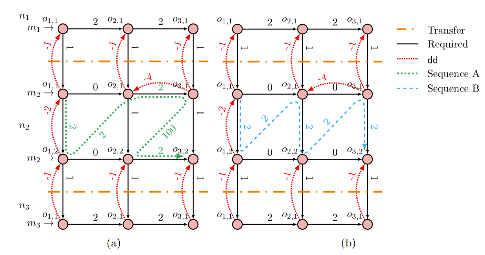

This problem is a counter-example that proves that the modular setup does not terminate. 

To do so, it builds a problem with three modules and two sequences:

Where sequence A increments input the bounds and sends them as output bounds to module 3 and sequence B propagates the output bounds to the input bounds.